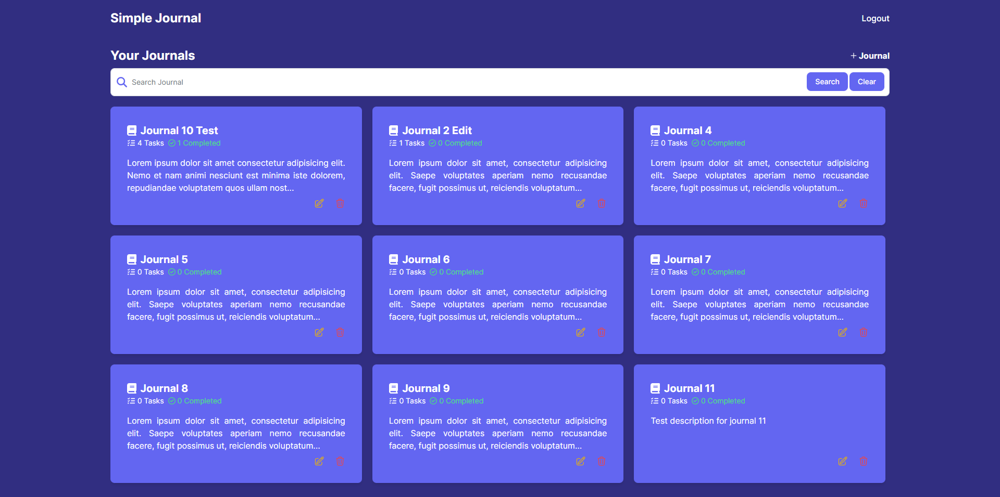
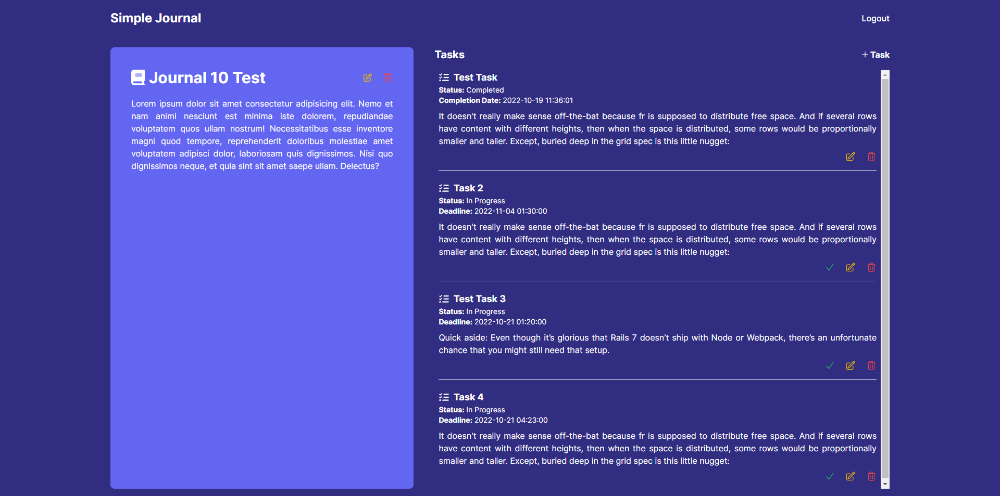
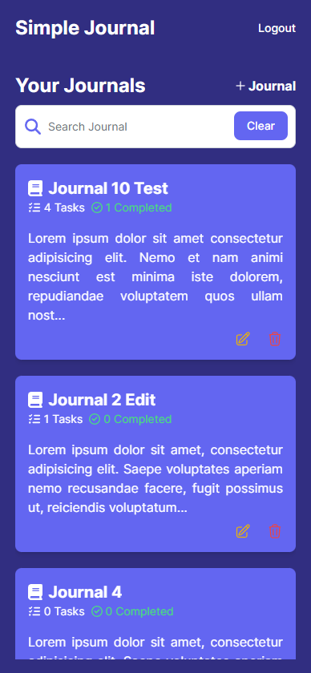
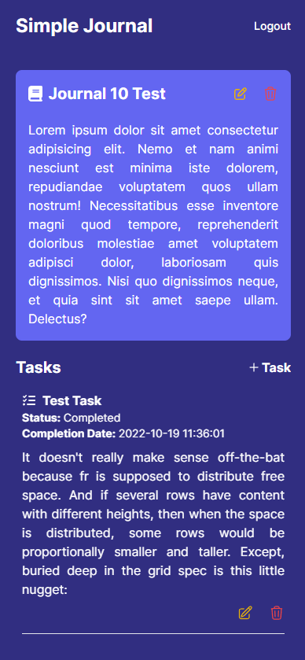

# Journal App

A simple journal app where users can create multiple journals with corresponding tasks that they can track. Click [here](https://jpldg-journal-app.herokuapp.com/) to view the app on Heroku. :smile:






## Built With

- [Ruby on Rails](https://rubyonrails.org/)
- [PostgreSQL](https://www.postgresql.org/)
- [TailwindCSS](https://tailwindcss.com/)

## Version
```
* Ruby 3.1.2
* Rails 7.0.4
```

## Setup
```
 $ bundle install
 $ rails db:setup
```
 
## Starting the application
```
 $ rails server
```
